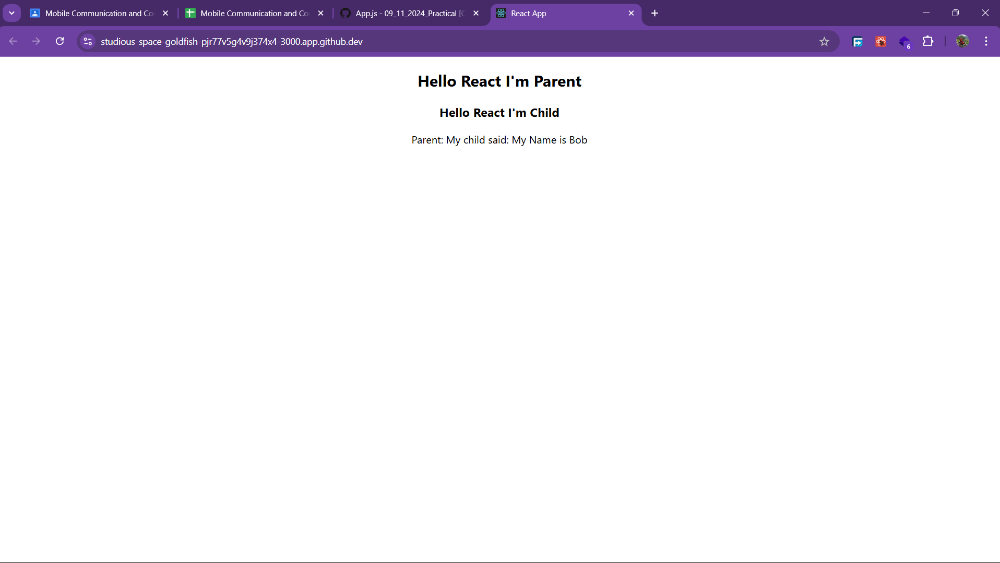

# 09_11_2024_Practical
---
## Code Explanation:
## App.js (Parent Component)
    - **State Management:** The App component uses the useState hook to manage the childName state.
    - **Function to Update State:** A function receiveName is defined to update the childName state. This function is passed to the child component via props.
    - **Display Data:** The childName state is displayed in the parent component.
## Childcomp.js (Child Component)
    - **Using Parent Props:** The Childcomp receives a function setfun as a prop from the parent.
    - **Update Parent State:** The function setfun is invoked in the child component, sending a string ("My Name is Bob") back to the parent component.

